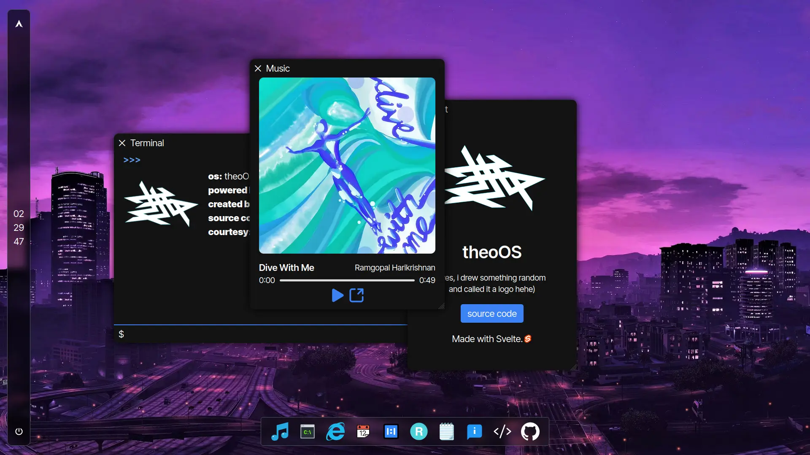

# "TheoOS" (hehe)

An OS-looking thingy made by me.  

Inspired by Yashash Pugalia's [win11-svelte](https://github.com/yashash-pugalia/win11-svelte).

## Resources

- [SvelteKit](https://kit.svelte.dev)
- [TailwindCSS](https://tailwindcss.com)
- [@neodrag/svelte](https://www.neodrag.dev/docs/svelte)